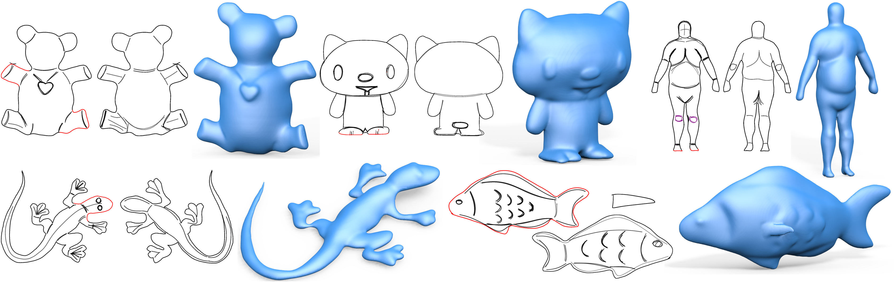

# Robust Flow-Guided Neural Prediction for Sketch-Based Freeform Surface Modeling

## Introduction
This repository contains the implementation of [SketchCNN](http://haopan.github.io/sketchCNN.html) proposed in our SIGGRAPH Asia 2018 paper.
* **Robust Flow-Guided Neural Prediction for Sketch-Based Freeform Surface Modeling** 
By [Changjian Li](https://enigma-li.github.io/), [Hao Pan](http://haopan.github.io/), [Yang Liu](https://xueyuhanlang.github.io/), [Xin Tong](https://www.microsoft.com/en-us/research/people/xtong/), [Alla Sheffer](https://www.cs.ubc.ca/~sheffa/), [Wenping Wang](http://i.cs.hku.hk/~wenping/), 
*ACM Trans. Graphics, 37(6), 2018, proceedings of SIGGRAPH Asia 2018.*

It contains two parts: 1) **network training**, and 2) the peripheral **training data generation** and **trained network deployment** (e.g. for interactive modeling). 

The code is released under the MIT license.

### Network training

💡 ***Great News***: we have released the docker image for network training, which will greatly reduce the configuration burden, please check the *networkTraining* folder for more details.

The network training part contains the **Python** code for building, training and testing the CNNs of predicting 3D freeform surfaces from 2D skethes using [TensorFlow](https://www.tensorflow.org/). 

Please read README file within the *network* folder for more details.

### Data generation and network deployment
The data generation and network deployment part contains the code for generating training data with customized OpenGL rendering and for deploying the trained network in a C++ project that can be an interactive 3D modeling application. It also provides instructions to download the training data we generated, and the checkpoint and frozen models of our trained networks. 

Please read the README file in *dataAndModel* folder for more details.

## Citation
If you use our code or model, please cite our paper:

	@Article {Li:2018:SketchCNN, 
		Title 		= {Robust Flow-Guided Neural Prediction for Sketch-Based Freeform Surface Modeling}, 
		Author 		= {Li, Changjian and Pan, Hao and Liu, Yang and Sheffer, Alla and Wang, Wenping}, 
		Journal 	= {ACM Trans. Graph. (SIGGRAPH ASIA)}, 
		issue_date 	= {November 2018},
		Year 		= {2018}, 
		Number 		= {6}, 
		Volume 		= {37},
		Pages		= {238:1--238:12},
		numpages 	= {12},
		DOI		= {https://doi.org/10.1145/3272127.3275051},
		Publisher 	= {ACM} 
	} 

## Acknowledge
We thank the authors of [Aim@Shape](http://visionair.ge.imati.cnr.it/ontologies/shapes/), [Princeton Segmentation Benchmark](https://gfx.cs.princeton.edu/pubs/Chen_2009_ABF/index.php) and [Stanford 3D Scanning Repository](http://graphics.stanford.edu/data/3Dscanrep/) for sharing their 3D models to the public and thank *Yuxiao Guo* for the inspiring discussions on network training.

## Contact
Any question you could contact Changjian Li (chjili2011@gmail.com) or Hao Pan (haopan@microsoft.com) for help.

